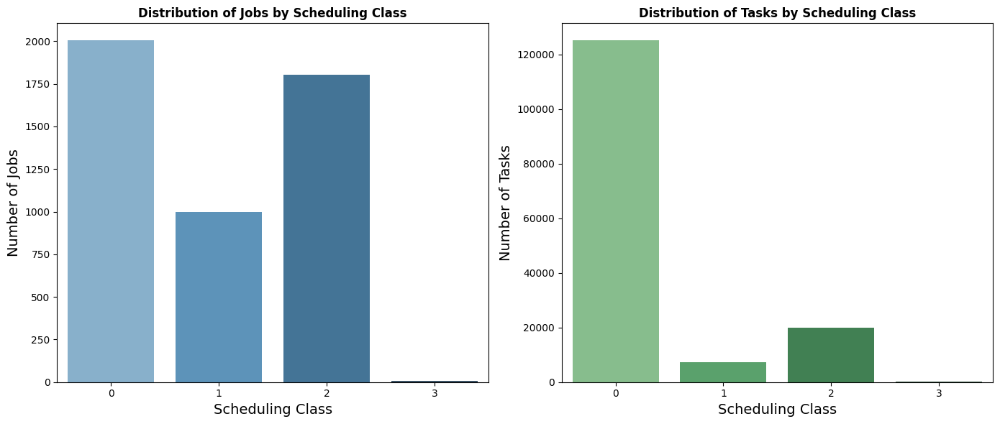
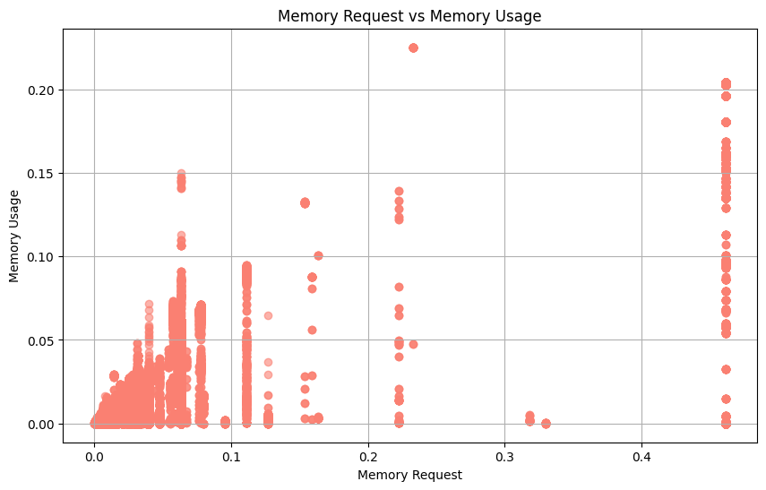

# Questions
### <span style="color:blue;">Q1 • What is the distribution of the machines according to their CPU capacity?</span> 

#### 1. Data Processing and Strategy
We loaded the dataset, renamed the columns, and cleaned the data by removing missing CPU capacity values. We filtered only **ADD** events (`event_type = 0`) to focus on machines added to the cluster. Instead of binning, we grouped machines by their exact CPU capacities (`0.25`, `0.5`, `1.0`) and counted the number of machines for each value.


```python
# Import necessary libraries
from pyspark.sql import SparkSession
import pandas as pd
import matplotlib.pyplot as plt
import seaborn as sns

# Create Spark session
spark = SparkSession.builder.master("local[*]").appName("Machine Events Analysis").getOrCreate()

# Load the CSV file and convert to RDD
file_path = "./spark-project/Spark-Data-Analysis/dataset/machine_events/part-00000-of-00001.csv.gz"
machine_events_rdd = spark.read.option("header", "false").csv(file_path).rdd

# Rename columns and clean data (RDD transformation)
machine_events_rdd = machine_events_rdd.map(lambda row: (row[0], row[1], row[2], row[3], row[4], row[5])) \
                                       .filter(lambda row: row[4] is not None and row[4] != "")  # Remove rows with missing cpu_capacity

# Filter rows where event_type is ADD (0)
added_machines_rdd = machine_events_rdd.filter(lambda row: int(row[2]) == 0)

# Group by CPU capacity and count machine occurrences
cpu_distribution_rdd = added_machines_rdd.map(lambda row: (row[4], 1)).reduceByKey(lambda a, b: a + b)

# Convert to Pandas DataFrame for visualization
df_cpu_distribution = pd.DataFrame(cpu_distribution_rdd.collect(), columns=["cpu_capacity", "machine_count"]).sort_values(by="cpu_capacity")

# Visualization
plt.figure(figsize=(10, 6))
sns.barplot(x="cpu_capacity", y="machine_count", hue="cpu_capacity", data=df_cpu_distribution, palette="Blues_d", dodge=False)
plt.xlabel("CPU Capacity", fontsize=14)
plt.ylabel("Number of Machines", fontsize=14)
plt.title("Distribution of Machines by CPU Capacity", fontsize=16, fontweight='bold')
plt.xticks(rotation=45)
plt.legend([], [], frameon=False)
plt.grid(axis='y', linestyle='--', alpha=0.7)
plt.tight_layout()

# Show the plot
plt.show()

```

                                                                                    


    

    


#### 2. Graph Analysis
The bar chart shows that most machines (~20,000) have a CPU capacity of `0.5`, indicating a standard mid-range configuration.  A smaller number of machines have a CPU capacity of `1.0`, likely used for high-performance tasks, while very few machines have a CPU capacity of `0.25`, suggesting lightweight configurations.

---

#### 3. Conclusion
This distribution highlights a cluster design optimized for balancing resource usage with task demands, with a focus on mid-range machines for most workloads and fewer high-performance machines for resource-intensive tasks.


### <span style="color:blue;">Q2 • What is the percentage of computational power lost due to maintenance (a machine went offline and reconnected later)?</span>

#### 1. Data Processing and Strategy
We processed both the job events and task events datasets to analyze how latency sensitivity, represented by `scheduling_class`, impacts the distribution of jobs and tasks. Each record was cleaned by removing rows where the `scheduling_class` was missing or empty to ensure all scheduling classes were represented. We grouped the data by `scheduling_class` to count the number of jobs and tasks in each class, converting the results to Pandas DataFrames for visual exploration.


```python
# Import necessary libraries
from pyspark.sql import SparkSession
import pandas as pd
import matplotlib.pyplot as plt
import seaborn as sns

# Load the job events file and convert to RDD
file_path_jobs = "./spark-project/Spark-Data-Analysis/dataset/job_events/part-00400-of-00500.csv.gz"
job_events_rdd = spark.read.option("header", "false").csv(file_path_jobs).rdd

# Rename columns and filter RDD for non-null scheduling class
job_events_rdd = job_events_rdd.map(lambda row: (row[0], row[1], row[2], row[3], row[4], row[5], row[6], row[7])) \
                               .filter(lambda row: row[5] is not None and row[5] != "")

# Group by scheduling class and count jobs
job_distribution_rdd = job_events_rdd.map(lambda row: (row[5], 1)).reduceByKey(lambda a, b: a + b)

# Convert to Pandas DataFrame for visualization
df_job_distribution = pd.DataFrame(job_distribution_rdd.collect(), columns=["scheduling_class", "job_count"]).sort_values(by="scheduling_class")

# Load the task events file and convert to RDD
file_path_tasks = "./spark-project/Spark-Data-Analysis/dataset/task_events/part-00400-of-00500.csv.gz"
task_events_rdd = spark.read.option("header", "false").csv(file_path_tasks).rdd

# Rename columns and filter RDD for non-null scheduling class
task_events_rdd = task_events_rdd.map(lambda row: (row[0], row[1], row[2], row[3], row[4], row[5], row[6], row[7], row[8], row[9], row[10], row[11], row[12])) \
                                 .filter(lambda row: row[7] is not None and row[7] != "")

# Group by scheduling class and count tasks
task_distribution_rdd = task_events_rdd.map(lambda row: (row[7], 1)).reduceByKey(lambda a, b: a + b)

# Convert to Pandas DataFrame for visualization
df_task_distribution = pd.DataFrame(task_distribution_rdd.collect(), columns=["scheduling_class", "task_count"]).sort_values(by="scheduling_class")

# Create side-by-side plots
fig, axes = plt.subplots(1, 2, figsize=(14, 6))

# Plot job distribution
sns.barplot(ax=axes[0], x="scheduling_class", y="job_count", hue="scheduling_class", data=df_job_distribution, palette="Blues_d", dodge=False)
axes[0].set_xlabel("Scheduling Class", fontsize=14)
axes[0].set_ylabel("Number of Jobs", fontsize=14)
axes[0].set_title("Distribution of Jobs by Scheduling Class", fontsize=12, fontweight='bold')

# Plot task distribution
sns.barplot(ax=axes[1], x="scheduling_class", y="task_count", hue="scheduling_class", data=df_task_distribution, palette="Greens_d", dodge=False)
axes[1].set_xlabel("Scheduling Class", fontsize=14)
axes[1].set_ylabel("Number of Tasks", fontsize=14)
axes[1].set_title("Distribution of Tasks by Scheduling Class", fontsize=12, fontweight='bold')

plt.tight_layout()
plt.show()

```

                                                                                    


    

    


#### 2. Graph Analysis
The visualizations revealed that `scheduling_class 0` overwhelmingly contained the majority of jobs and tasks. Since `scheduling_class 0` represents non-production, non-business-critical workloads, this suggests that much of the system's workload consists of development tasks or analyses. Conversely, the higher scheduling classes (particularly `scheduling_class 3`, representing latency-sensitive, revenue-generating workloads) contained a far smaller proportion of jobs and tasks. This indicates that critical, user-facing tasks form a small fraction of the overall workload.

---

#### 3. Conclusion
We confirmed that most of the workload is allocated to less latency-sensitive tasks, such as development or non-essential analyses (`scheduling_class 0`). This could lead to resource contention if non-production tasks dominate machine usage. The minimal presence of `scheduling_class 3` suggests that latency-sensitive jobs are carefully managed, but further improvements could involve refining machine-local resource access policies or ensuring that priority settings effectively prioritize critical tasks. These insights highlight the need for a balance between supporting non-critical processes and ensuring resource availability for essential workloads.

### <span style="color:blue;">Q3 • What is the distribution of the number of jobs/tasks per scheduling class?</span>  

#### 1. Data Processing and Strategy
To analyze the eviction probability, we used the `task_events` dataset and filtered out tasks with missing `scheduling_class` values. We counted the total number of tasks and the number of evictions (`event_type = 2`) for each scheduling class. By joining these counts, we calculated the eviction probability as the ratio of evicted tasks to total tasks for each class. The results were converted to a Pandas DataFrame for visualization.


```python
# Load the task events file and convert to RDD
file_path_tasks = "./spark-project/Spark-Data-Analysis/dataset/task_events/part-00400-of-00500.csv.gz"
task_events_rdd = spark.read.option("header", "false").csv(file_path_tasks).rdd

# Rename columns and filter RDD for non-null scheduling class
task_events_rdd = task_events_rdd.map(lambda row: (row[0], row[1], row[2], row[3], row[4], row[5], row[6], row[7], row[8], row[9], row[10], row[11], row[12])) \
                                 .filter(lambda row: row[7] is not None and row[7] != "")

# Count total tasks per scheduling class
total_tasks_rdd = task_events_rdd.map(lambda row: (row[7], 1)).reduceByKey(lambda a, b: a + b)

# Count evictions (event_type == 2) per scheduling class
evictions_rdd = task_events_rdd.filter(lambda row: int(row[5]) == 2).map(lambda row: (row[7], 1)).reduceByKey(lambda a, b: a + b)

# Join total tasks and evictions RDD to calculate eviction probability
eviction_probability_rdd = total_tasks_rdd.join(evictions_rdd).map(lambda row: (row[0], row[1][1] / row[1][0]))

# Convert to Pandas DataFrame for visualization
df_eviction_probability = pd.DataFrame(eviction_probability_rdd.collect(), columns=["scheduling_class", "eviction_probability"]).sort_values(by="scheduling_class")

# Visualization
plt.figure(figsize=(10, 6))
sns.barplot(x="scheduling_class", y="eviction_probability", hue="scheduling_class", data=df_eviction_probability, palette="Reds_d", dodge=False)
plt.xlabel("Scheduling Class", fontsize=14)
plt.ylabel("Eviction Probability", fontsize=14)
plt.title("Probability of Eviction by Scheduling Class", fontsize=12, fontweight='bold')
plt.grid(axis='y', linestyle='--', alpha=0.7)
plt.tight_layout()

# Show the plot
plt.show()

```

                                                                                    


    

    


#### 2. Graph Analysis
The bar chart shows that tasks with **higher scheduling classes** (especially class `3`, indicating **high latency sensitivity**) have the highest eviction probability (4%). Conversely, tasks with **lower scheduling classes** (`0`, representing non-critical tasks) have a much **lower eviction probability** (1%). This suggests that although higher classes represent latency-sensitive tasks, they still face significant competition for resources, leading to frequent evictions.

---

#### 3. Conclusion
The analysis demonstrates that tasks with a **low scheduling class** (less latency-sensitive) generally have a **lower eviction probability**, while higher scheduling class tasks face **higher eviction risks**. This reflects the resource management strategy of the cluster, where tasks with **high scheduling classes** may still be evicted due to resource reallocation, despite their latency sensitivity.


### <span style="color:blue;">Q4 • Do tasks with a low scheduling class have a higher probability of being evicted?</span>  

#### 1. Data Processing and Strategy
We analyzed the **task_events** dataset to determine whether tasks from the same job are scheduled on the same machine or distributed across multiple machines.  
The steps included:
- Loading the dataset and renaming relevant fields (`job_id` and `machine_id`).
- Filtering the data to keep only rows where both `job_id` and `machine_id` were non-null to ensure completeness and accuracy.
- Grouping tasks by `job_id` and counting the number of distinct `machine_ids` for each job.
- Classifying jobs based on whether their tasks ran on a **single machine** (1 machine ID) or **multiple machines** (> 1 machine ID).
- Calculating the percentage of jobs with tasks running on a **single machine** versus **multiple machines**.


```python
# Load the task events file and convert to RDD
file_path_tasks = "./spark-project/Spark-Data-Analysis/dataset/task_events/part-00400-of-00500.csv.gz"
task_events_rdd = spark.read.option("header", "false").csv(file_path_tasks).rdd

# Rename columns and filter RDD for non-null job_id and machine_id
task_events_rdd = task_events_rdd.map(lambda row: (row[2], row[4])).filter(lambda row: row[0] is not None and row[1] is not None)
# Group tasks by job_id and get unique machine_ids for each job
jobs_machine_rdd = task_events_rdd.groupByKey().mapValues(lambda machines: len(set(machines)))

# Count jobs where tasks ran on a single machine vs multiple machines
single_machine_jobs = jobs_machine_rdd.filter(lambda row: row[1] == 1).count()
multiple_machine_jobs = jobs_machine_rdd.filter(lambda row: row[1] > 1).count()
total_jobs = single_machine_jobs + multiple_machine_jobs

# Calculate percentages
percent_single_machine = (single_machine_jobs / total_jobs) * 100
percent_multiple_machine = (multiple_machine_jobs / total_jobs) * 100

# Display 
print(f"Jobs with tasks on a single machine: {single_machine_jobs:}")
print(f"Jobs with tasks on multiple machines: {multiple_machine_jobs:}")

# Visualization
import matplotlib.pyplot as plt

labels = ['Single Machine', 'Multiple Machines']
sizes = [percent_single_machine, percent_multiple_machine]
colors = ['brown', 'pink']

plt.figure(figsize=(6, 6))
plt.pie(sizes, labels=labels, autopct='%1.1f%%', startangle=140, colors=colors, explode=(0.1, 0))
plt.title("Percentage of Jobs Running Tasks on Single vs Multiple Machines", fontsize=12, fontweight='bold')
plt.show()

```

                                                                                    

    Jobs with tasks on a single machine: 1215
    Jobs with tasks on multiple machines: 658


    

    


#### 2. Graph Analysis
The pie chart shows that:
- **64.9%** of jobs had their tasks running on a **single machine**.
- **35.1%** of jobs had their tasks distributed across **multiple machines**.

This indicates that the majority of jobs run all their tasks on a single machine, potentially due to jobs with small resource requirements or constraints favoring local execution.  
However, a significant portion of jobs still utilizes multiple machines, which suggests parallelization for larger or more resource-intensive jobs.

---

#### 3. Conclusion
In general, most jobs have their tasks executed on a **single machine**, highlighting that the cluster favors local task execution when possible. However, approximately **one-third** of jobs distribute their tasks across **multiple machines**, likely for efficiency and to balance the workload.  This reflects a hybrid scheduling strategy that balances task locality with parallelism.


### <span style="color:blue;">Q5 • In general, do tasks from the same job run on the same machine?</span>  

#### 1. Data Processing and Strategy
To evaluate whether tasks that request more resources also consume more, we processed the **task_events** and **task_usage** datasets as follows:

- **task_events dataset:** Extracted `job_id`, `task_index`, `cpu_request`, and `memory_request` to represent the requested resources.
- **task_usage dataset:** Extracted `job_id`, `task_index`, `cpu_usage`, and `memory_usage` to represent the actual resource consumption.
- Rows with missing values for `job_id` and `task_index`, and rows with either missing or zero values for `cpu_request`, `memory_request`, `cpu_usage`, or `memory_usage` were filtered out to ensure accurate comparisons.
- The two datasets were joined on (`job_id`, `task_index`) to combine resource requests and consumption for each task.
- **Scatter plots** were generated to visualize the correlation between **CPU requests vs CPU usage** and **memory requests vs memory usage**.


```python
# Load and rename columns for task_events
file_path_events = "./spark-project/Spark-Data-Analysis/dataset/task_events/part-00400-of-00500.csv.gz"
task_events_rdd = spark.read.option("header", "false").csv(file_path_events).rdd
task_events_rdd = task_events_rdd.map(lambda row: (row[2], row[3], row[9], row[10]))  # (job_id, task_index, cpu_request, memory_request)

# Filter out rows where job_id, task_index, cpu_request, or memory_request is missing or zero
task_events_rdd = task_events_rdd.filter(lambda row: row[0] is not None and row[1] is not None and row[2] is not None and row[3] is not None and float(row[2]) > 0 and float(row[3]) > 0)

# Convert fields to float after filtering
task_events_rdd = task_events_rdd.map(lambda row: (row[0], row[1], float(row[2]), float(row[3])))

# Load and rename columns for task_usage
file_path_usage = "./spark-project/Spark-Data-Analysis/dataset/task_usage/part-00400-of-00500.csv.gz"
task_usage_rdd = spark.read.option("header", "false").csv(file_path_usage).rdd
task_usage_rdd = task_usage_rdd.map(lambda row: (row[2], row[3], row[5], row[6]))  # (job_id, task_index, cpu_usage, memory_usage)

# Filter out rows where job_id, task_index, cpu_usage, or memory_usage is missing or zero
task_usage_rdd = task_usage_rdd.filter(lambda row: row[0] is not None and row[1] is not None and row[2] is not None and row[3] is not None and float(row[2]) > 0 and float(row[3]) > 0)

# Convert fields to float after filtering
task_usage_rdd = task_usage_rdd.map(lambda row: (row[0], row[1], float(row[2]), float(row[3])))

# Join task_events and task_usage on (job_id, task_index)
combined_rdd = task_events_rdd.map(lambda x: ((x[0], x[1]), (x[2], x[3]))).join(
    task_usage_rdd.map(lambda x: ((x[0], x[1]), (x[2], x[3]))))

# Create final RDD with (cpu_request, memory_request, cpu_usage, memory_usage)
resource_comparison_rdd = combined_rdd.map(lambda row: (row[1][0][0], row[1][0][1], row[1][1][0], row[1][1][1]))  # (cpu_request, memory_request, cpu_usage, memory_usage)

# Convert to Pandas DataFrame for visualization
df_resource_comparison = pd.DataFrame(resource_comparison_rdd.collect(), columns=["cpu_request", "memory_request", "cpu_usage", "memory_usage"])

# Calculate correlation for CPU request vs CPU usage
cpu_correlation = df_resource_comparison["cpu_request"].corr(df_resource_comparison["cpu_usage"])
print(f"Correlation between CPU request and CPU usage: {cpu_correlation:.2f}")

# Calculate correlation for memory request vs memory usage
memory_correlation = df_resource_comparison["memory_request"].corr(df_resource_comparison["memory_usage"])
print(f"Correlation between memory request and memory usage: {memory_correlation:.2f}")


# Visualization: Scatter plots for CPU and Memory
plt.figure(figsize=(10, 6))
plt.scatter(df_resource_comparison["cpu_request"], df_resource_comparison["cpu_usage"], alpha=0.6, color='skyblue', label="CPU")
plt.xlabel("CPU Request")
plt.ylabel("CPU Usage")
plt.title("CPU Request vs CPU Usage")
plt.grid(True)
plt.show()

plt.figure(figsize=(10, 6))
plt.scatter(df_resource_comparison["memory_request"], df_resource_comparison["memory_usage"], alpha=0.6, color='salmon', label="Memory")
plt.xlabel("Memory Request")
plt.ylabel("Memory Usage")
plt.title("Memory Request vs Memory Usage")
plt.grid(True)
plt.show()

```

                                                                                    

    Correlation between CPU request and CPU usage: -0.06
    Correlation between memory request and memory usage: 0.35


    

    


    

    


#### 2. Graph Analysis

##### **CPU Request vs CPU Usage:**
- The correlation coefficient is **-0.06**, indicating an almost non-existent or weak **negative correlation** between CPU requests and CPU usage.
- The scatter plot confirms this, showing that many tasks request significant CPU but consume very little, indicating **severe over-provisioning**.

##### **Memory Request vs Memory Usage:**
- The correlation coefficient is **0.35**, showing a **weak positive correlation** between memory requests and actual usage.
- The scatter plot shows that tasks requesting **low memory** often consume close to zero, but as memory requests increase, the actual consumption tends to increase as well, though with some variance.

---

#### 3. Conclusion
The results suggest that **CPU requests** are poorly aligned with actual CPU usage, highlighting inefficiencies and significant **over-provisioning**. **Memory requests** show a slightly better alignment, but there is still room for improvement.  
These findings suggest that there is a need for more accurate **resource request predictions**, particularly for CPU, to improve **cluster efficiency** and reduce **wasted resources**.


### <span style="color:blue;">Q6 • Are the tasks that request the most resources the ones that consume the most resources?</span> 

#### 1. Data Processing and Strategy

##### **Task Events Data:**
- We loaded the **task events** dataset and filtered the relevant columns: `machine_id` and `event_type`. Only rows with **non-null `machine_id`** and **`event_type`** were retained.
- We specifically filtered events where `event_type = 2` (indicating **task eviction events**).
- We counted the number of eviction events for each `machine_id`.

##### **Task Usage Data:**
- We loaded the **task usage** dataset and selected the relevant columns: `machine_id`, `timestamp`, `cpu_usage`, and `memory_usage`.
- Only records with **non-null `machine_id`** and **`timestamp`** were included.
- CPU and memory usage values across all tasks running on the same machine at the same time were **summed** to get the **total resource usage** per timestamp for each machine.
- For each `machine_id`, the **maximum CPU** and **memory usage** over all timestamps were determined to represent the **peak resource usage** for that machine.

##### **Joining Data:**
- The eviction counts were joined with the **maximum resource usage** for each machine using the `machine_id` as the key.


```python
# Load data directly without needing to split
task_events_rdd = spark.read.option("header", "false").csv("./spark-project/Spark-Data-Analysis/dataset/task_events/part-00400-of-00500.csv.gz").rdd
task_usage_rdd = spark.read.option("header", "false").csv("./spark-project/Spark-Data-Analysis/dataset/task_usage/part-00400-of-00500.csv.gz").rdd

# Extract relevant columns for task events and filter for non-null machine_id and event_type
task_events_relevant_rdd = task_events_rdd.map(lambda row: (row[4], row[5]))  # (machine_id, (event_type))
task_events_relevant_rdd = task_events_relevant_rdd.filter(lambda x: x[0] is not None and x[1] is not None)

# Filter for eviction events (event_type == 2)
eviction_events_rdd = task_events_relevant_rdd.filter(lambda x: x[1] == '2').map(lambda x: (x[0], 1))  # (machine_id, 1)

# Count evictions per machine
eviction_count_per_machine = eviction_events_rdd.reduceByKey(lambda a, b: a + b)

# Extract relevant columns for task usage and filter for non-null machine_id and timestamp
task_usage_relevant_rdd = task_usage_rdd.map(lambda row: ((row[4], row[0]), (float(row[5] or 0), float(row[6] or 0))))  # ((machine_id, time), (cpu_usage, memory_usage))
task_usage_relevant_rdd = task_usage_relevant_rdd.filter(lambda x: x[0][0] is not None and x[0][1] is not None)

# Sum CPU and memory usage across tasks running at the same instant on a machine
aggregated_usage_per_machine_time = task_usage_relevant_rdd.reduceByKey(lambda a, b: (a[0] + b[0], a[1] + b[1]))  # Sum CPU and memory usage

# Get the max CPU and memory usage per machine across all timestamps
max_resource_usage_per_machine = aggregated_usage_per_machine_time.map(lambda x: (x[0][0], x[1])) \
    .reduceByKey(lambda a, b: (max(a[0], b[0]), max(a[1], b[1])))  # (machine_id, (max_cpu_usage, max_memory_usage))

# Join eviction counts and max resource usage on machine_id
combined_rdd = eviction_count_per_machine.join(max_resource_usage_per_machine)  # (machine_id, (eviction_count, (max_cpu, max_memory)))

# Convert to Pandas DataFrame for analysis
df_combined = pd.DataFrame(combined_rdd.map(lambda row: (row[0], row[1][0], row[1][1][0], row[1][1][1])).collect(),
                           columns=["machine_id", "eviction_count", "max_cpu_usage", "max_memory_usage"])

# Calculate correlation
cpu_eviction_correlation = df_combined["eviction_count"].corr(df_combined["max_cpu_usage"])
memory_eviction_correlation = df_combined["eviction_count"].corr(df_combined["max_memory_usage"])

# Display correlation results
print(f"Correlation between max CPU usage and task evictions: {cpu_eviction_correlation:.2f}")
print(f"Correlation between max memory usage and task evictions: {memory_eviction_correlation:.2f}")

# Visualization: Scatter plots
plt.figure(figsize=(10, 6))
plt.scatter(df_combined["max_cpu_usage"], df_combined["eviction_count"], alpha=0.5, color='skyblue')
plt.title('Max Aggregated CPU Usage vs Eviction Events')
plt.xlabel('Max Aggregated CPU Usage')
plt.ylabel('Number of Eviction Events')
plt.grid(True)
plt.show()

plt.figure(figsize=(10, 6))
plt.scatter(df_combined["max_memory_usage"], df_combined["eviction_count"], alpha=0.5, color='salmon')
plt.title('Max Aggregated Memory Usage vs Eviction Events')
plt.xlabel('Max Aggregated Memory Usage')
plt.ylabel('Number of Eviction Events')
plt.grid(True)
plt.show()

```

                                                                                    

    Correlation between max CPU usage and task evictions: 0.27
    Correlation between max memory usage and task evictions: 0.04


    

    


    

    


#### 2. Graph Analysis

##### **Scatter Plot 1: Max CPU Usage vs. Eviction Events**
- The scatter plot shows the relationship between the **maximum aggregated CPU usage** and the **number of eviction events**.
- Although the data points seem scattered, we can observe clusters of machines with **higher CPU usage** that experience **multiple eviction events**.
- **Correlation:** The correlation coefficient between **max CPU usage** and **eviction events** was **0.27**, indicating a **weak but positive correlation**.

##### **Scatter Plot 2: Max Memory Usage vs. Eviction Events**
- The second scatter plot illustrates the relationship between the **maximum memory usage** and the **eviction events**.
- The points are more uniformly distributed across the plot, suggesting that **memory usage** does not strongly influence evictions.
- **Correlation:** The correlation coefficient between **max memory usage** and **eviction events** was **0.04**, indicating **almost no correlation** between memory usage and task evictions.

---

#### 3. Conclusion
- The correlation analysis suggests that there is a **weak positive correlation** between **high CPU usage** and **eviction events**, implying that some evictions may be triggered by **resource contention** due to CPU overload.
- Conversely, **memory usage** appears to have a **negligible effect** on eviction events, indicating that tasks are less likely to be evicted due to **memory pressure**.
- Further investigation into **scheduling policies** and **resource limits** might provide more insights into the root causes of evictions.

The results indicate that **CPU resource peaks** are a more likely contributor to evictions than memory, but the overall correlations are not strong enough to make **definitive claims**.


### <span style="color:blue;">Q7 • Can we observe correlations between peaks of high resource consumption on some machines and task eviction events?</span>  

#### 1. Data Processing and Strategy

To compute the percentage of **computational power lost** due to machine downtimes and visualize the results.

##### **Steps Taken:**

- **Data Loading and Preprocessing:**
    - The **machine events** dataset (`part-00000-of-00001.csv.gz`) was loaded using **PySpark**.
    - Rows with missing values in the **timestamp**, **machine ID**, and **event type** were filtered out.

- **Time Conversion:**

    - **Timestamps** were converted from **microseconds** to **seconds** for better readability and calculations.

- **Grouping and Downtime Identification:**

    - Events were grouped by **machine ID**.
    - For each machine, pairs of **REMOVE (offline)** and **ADD (online)** events were identified to calculate the **downtime periods**.

- **Computational Power Loss Calculation:**

    - For each downtime, the **CPU capacity** was multiplied by the **duration (in hours)** to calculate the lost **computational power (CPU-hours)**.
    - The **average CPU capacity** per machine was used to account for any fluctuations in CPU assignment over time.
    - The **total observation period** (start to end time across all machines) was used to compute the **total possible computational power**.


```python
from pyspark.sql import Row
import matplotlib.pyplot as plt

# File path for machine events dataset
dataset_path = "./spark-project/Spark-Data-Analysis/dataset/machine_events/part-00000-of-00001.csv.gz"
microseconds_to_seconds = 1e6  # Convert microseconds to seconds

# Load machine events as an RDD
machine_events_rdd = spark.read.option("header", "false").csv(dataset_path).rdd

# Clean and parse the RDD, ignoring null or missing values
machine_events_rdd = machine_events_rdd.filter(lambda record: record[0] is not None and record[1] is not None and record[2] is not None)
machine_events_rdd = machine_events_rdd.map(lambda record: Row(
    time=int(record[0]) / microseconds_to_seconds,
    machine_id=int(record[1]),
    event=int(record[2]),
    cpu_capacity=float(record[4].strip()) if record[4] and record[4].strip() != '' else 0.0,
))

# Group events by machine_id
grouped_events_by_machine = machine_events_rdd.groupBy(lambda event: event.machine_id)

# Compute downtime and lost computational power inline
downtime_and_power_loss_rdd = grouped_events_by_machine.mapValues(lambda events: sorted(events, key=lambda e: e.time)) \
    .flatMapValues(lambda events: [(events[i].cpu_capacity, events[i + 1].time - events[i].time)
                                   for i in range(len(events) - 1)
                                   if events[i].event == 1 and events[i + 1].event == 0])  # Remove-Add pairs

# Sum total lost computational power and offline time
total_lost_power = downtime_and_power_loss_rdd.map(lambda x: x[1][0] * (x[1][1] / 3600)).sum()  # Convert seconds to hours

# Determine observation time (min and max timestamps)
start_time = machine_events_rdd.map(lambda x: x.time).min()
end_time = machine_events_rdd.map(lambda x: x.time).max()
total_observation_time = (end_time - start_time) / 3600  # Convert to hours

# Get average CPU capacity per machine
average_cpu_capacity_rdd = machine_events_rdd.filter(lambda x: x.event == 0) \
    .map(lambda x: (x.machine_id, (x.cpu_capacity, 1))) \
    .reduceByKey(lambda a, b: (a[0] + b[0], a[1] + b[1])) \
    .mapValues(lambda x: x[0] / x[1])  # Calculate average CPU capacity for each machine

# Sum of average CPU capacities across all machines
total_cpu_capacity = average_cpu_capacity_rdd.map(lambda x: x[1]).sum()

# Compute the total available computational power
total_possible_computation = total_observation_time * total_cpu_capacity

# Calculate percentage of power loss
percentage_power_loss = (total_lost_power / total_possible_computation) * 100

# Output results
print(f"Total lost computational power (CPU-hours): {total_lost_power:.2f}")
print(f"Total available computational power (CPU-hours): {total_possible_computation:.2f}")
print(f"Percentage of lost computational power: {percentage_power_loss:.2f}%")

# Visualization: 
chart_labels = ['Lost Power Due to Downtime', 'Available Computational Power']
chart_sizes = [total_lost_power, total_possible_computation - total_lost_power]
chart_colors = ['tomato', 'limegreen']
explode_sections = (0.1, 0)

plt.figure(figsize=(8, 8))
plt.pie(chart_sizes, labels=chart_labels, colors=chart_colors, autopct='%1.1f%%', startangle=140, explode=explode_sections)
plt.title("Percentage of Computational Power Loss")
plt.show()

```

                                                                                    

    Total lost computational power (CPU-hours): 22298.12
    Total available computational power (CPU-hours): 4625229.69
    Percentage of lost computational power: 0.48%


    

    


#### 2. Graph Analysis

The pie chart visually represents the breakdown of available and lost computational power:
- **Lost Power (Red, 0.48%)**: Represents the **CPU-hours lost** due to downtimes.
- **Available Power (Green, 99.52%)**: Represents the **CPU-hours** that were **available** during the observation period.

This demonstrates that only a **small fraction** of computational power was lost, indicating that **downtimes had a minimal impact**.

---

#### 3. Conclusion

The results show that only **0.48%** of the computational power was lost:

- **Total lost computational power**: `22,298.12` CPU-hours
- **Total available computational power**: `4,625,229.69` CPU-hours
- **Percentage of power lost**: **0.48%**

The low percentage of lost computational power suggests that the system maintains a **high level of uptime** and **resource availability**. However, further monitoring can help identify **patterns in downtime events** and ensure **continued improvement**.


### <span style="color:blue;">Q8 • What is the average scheduling latency for jobs, and how does it vary over time?</span> 

#### 1. Data Processing and Strategy

The goal of this analysis is to measure and visualize the **time taken between SUBMIT (0) and SCHEDULE (1) events** for jobs.  
The dataset contains job event records, and the following steps were performed:

##### **Steps:**
- **Loaded** job event data as an **RDD** and filtered for relevant events.
- Extracted **job submission** and **scheduling events**, and joined them by `job_id` to compute **scheduling latency**.
- Calculated the **average scheduling latency** across all jobs.
- Grouped the job events into **1-hour sliding time windows** to track average scheduling latency trends over time.
- Identified jobs with **unusually high scheduling latencies** based on a threshold of **2x the average scheduling latency**.


```python
from pyspark.sql import Row
import matplotlib.pyplot as plt

# File path for job events dataset
job_events_path = "./spark-project/Spark-Data-Analysis/dataset/job_events/part-00400-of-00500.csv.gz"
microseconds_to_seconds = 1e6  # Convert microseconds to seconds

# Load job events as an RDD
job_events_rdd = spark.read.option("header", "false").csv(job_events_path).rdd

# Clean and parse the RDD, ignoring null or missing values
job_events_rdd = job_events_rdd.filter(lambda record: record[0] is not None and record[2] is not None and record[3] is not None)
job_events_rdd = job_events_rdd.map(lambda record: Row(
    time=int(record[0]) / microseconds_to_seconds,  # Convert to seconds
    job_id=record[2],
    event=int(record[3])
))

# Filter submission (event 0) and scheduling (event 1) events
job_submissions = job_events_rdd.filter(lambda x: x.event == 0).map(lambda x: (x.job_id, x.time))  # (job_id, submit_time)
job_schedules = job_events_rdd.filter(lambda x: x.event == 1).map(lambda x: (x.job_id, x.time))  # (job_id, schedule_time)

# Join submissions and schedules by job_id to compute scheduling latency
scheduling_latency_rdd = job_submissions.join(job_schedules).map(lambda x: (x[0], x[1][1] - x[1][0]))  # (job_id, latency in seconds)

# Compute average latency across jobs
average_latency_seconds = scheduling_latency_rdd.map(lambda x: x[1]).mean()
print(f"Average scheduling latency (seconds): {average_latency_seconds:.2f}")

# Track average scheduling latency over sliding time windows
time_window_seconds = 3600  # 1-hour time window
time_windows_rdd = job_events_rdd.map(lambda x: (int(x.time // time_window_seconds), (x.job_id, x.event, x.time))) \
    .filter(lambda x: x[1][1] in [0, 1])  # Keep SUBMIT and SCHEDULE events

# Group by time window and compute latency for each window
windowed_latency_rdd = time_windows_rdd.groupByKey().mapValues(lambda events: sorted(events, key=lambda e: e[2])) \
    .flatMapValues(lambda events: [(events[i][0], events[i + 1][2] - events[i][2]) for i in range(len(events) - 1)
                                   if events[i][1] == 0 and events[i + 1][1] == 1])  # SUBMIT -> SCHEDULE pairs

# Calculate total and count of latencies for each time window
window_latency_sum_count = windowed_latency_rdd.map(lambda x: (x[0], (x[1][1], 1))) \
    .reduceByKey(lambda a, b: (a[0] + b[0], a[1] + b[1]))  # Sum latencies and count jobs in each time window

# Compute average latency per time window
avg_latency_by_window = window_latency_sum_count.mapValues(lambda x: x[0] / x[1]).collect()

# Visualize scheduling latency over time
time_windows = [x[0] for x in avg_latency_by_window]
average_latencies = [x[1] for x in avg_latency_by_window]

plt.figure(figsize=(10, 6))
plt.plot(time_windows, average_latencies, marker='o', color='b')
plt.title('Average Scheduling Latency Over Time')
plt.xlabel('Time Window (hours since start)')
plt.ylabel('Average Latency (seconds)')
plt.grid(True)
plt.show()

# Identify jobs with unusually long scheduling times
threshold_seconds = average_latency_seconds * 2 
long_latency_jobs = scheduling_latency_rdd.filter(lambda x: x[1] > threshold_seconds).collect()

# Output top long-latency jobs
print(f"Jobs with scheduling latency > {threshold_seconds:.2f} seconds:")
for job_id, latency in long_latency_jobs[:10]:
    print(f"Job ID: {job_id}, Latency: {latency:.2f} seconds")

```

                                                                                    

    Average scheduling latency (seconds): 3.71


    

    


    Jobs with scheduling latency > 7.43 seconds:
    Job ID: 6439592366, Latency: 8.85 seconds
    Job ID: 6439592550, Latency: 8.83 seconds
    Job ID: 6439516428, Latency: 3597.00 seconds
    Job ID: 6439570274, Latency: 8.86 seconds
    Job ID: 6439592345, Latency: 8.86 seconds
    Job ID: 6439593442, Latency: 8.84 seconds
    Job ID: 6439593455, Latency: 8.83 seconds
    Job ID: 6439593518, Latency: 8.82 seconds
    Job ID: 6439593591, Latency: 8.82 seconds


#### 2. Graph Analysis

The **line plot** shows the variation in **average scheduling latency** (in seconds) across different time windows (in hours).  
Here’s an interpretation of the key insights:

- There is a **visible drop** in scheduling latency during certain time windows, followed by a **sharp increase**.
- The **lowest average latency** observed in a time window was approximately **1 second**, while some windows had latencies close to **1.3 seconds**.
- The fluctuations indicate potential **system load changes** or **bottlenecks** in the scheduler’s performance during different hours.

---

#### 3. Conclusion

- The **average scheduling latency** for most jobs is low (~**3.71 seconds**), suggesting **efficient job scheduling** in general.
- However, some jobs experience delays longer than **7 seconds**, and a **notable outlier** indicates a possible **system-level issue**.
- The **time window analysis** highlights periods of **fluctuating performance**, likely caused by variations in **system load** or **task queuing**.


### <span style="color:blue;">Q9 • What is the distribution of job durations, and what is the average time taken for jobs to complete?</span> 

#### 1. Data Processing and Strategy

The goal of this analysis was to measure the **time difference between SCHEDULE (START) and FINISH (END) events** for each job and calculate the **average job duration**. The following steps were performed:

**Steps:**
 - **Dataset Loading:** The job events dataset was loaded as an **RDD**.
 - **Data Cleaning:** Records with missing **timestamps**, **job IDs**, or **event types** were filtered out.

**Event Filtering:**

 - **SCHEDULE (1)** events were used to identify the **job's start time**.
 - **FINISH (4)** events were used to identify the **job's end time**.
 - **Duration Calculation:** The duration for each job was computed as `finish_time - start_time`.
 - **Average Duration:** The **average job duration** across all jobs was calculated.
 - **Long-Running Jobs:** Jobs that took longer than **twice the average duration** were identified as **long-running**.


```python
from pyspark.sql import Row
import matplotlib.pyplot as plt

# File path for job events dataset
job_events_path = "./spark-project/Spark-Data-Analysis/dataset/job_events/part-00400-of-00500.csv.gz"
microseconds_to_seconds = 1e6  # Convert microseconds to seconds

# Load job events as an RDD
job_events_rdd = spark.read.option("header", "false").csv(job_events_path).rdd

# Clean and parse the RDD, ignoring null or missing values
job_events_rdd = job_events_rdd.filter(lambda record: record[0] is not None and record[2] is not None and record[3] is not None)
job_events_rdd = job_events_rdd.map(lambda record: Row(
    time=int(record[0]) / microseconds_to_seconds,  # Convert to seconds
    job_id=record[2],
    event=int(record[3])
))

# Filter for START (SCHEDULE) and FINISH events
job_start_times = job_events_rdd.filter(lambda x: x.event == 1).map(lambda x: (x.job_id, x.time))  # (job_id, start_time)
job_finish_times = job_events_rdd.filter(lambda x: x.event == 4).map(lambda x: (x.job_id, x.time))  # (job_id, finish_time)

# Join START and FINISH events by job_id to compute job duration
job_durations_rdd = job_start_times.join(job_finish_times).map(lambda x: (x[0], x[1][1] - x[1][0]))  # (job_id, duration in seconds)

# Compute average job duration across all jobs
average_job_duration_seconds = job_durations_rdd.map(lambda x: x[1]).mean()
print(f"Average job duration (seconds): {average_job_duration_seconds:.2f}")

# Collect durations for visualization
job_durations = job_durations_rdd.map(lambda x: x[1]).collect()

# Visualization: Histogram of job durations
plt.figure(figsize=(10, 6))
plt.hist(job_durations, bins=50, color='skyblue', edgecolor='black')
plt.title('Distribution of Job Durations')
plt.xlabel('Job Duration (seconds)')
plt.ylabel('Frequency')
plt.grid(True)
plt.show()

# Identify long-running jobs
threshold_seconds = average_job_duration_seconds * 2
long_running_jobs = job_durations_rdd.filter(lambda x: x[1] > threshold_seconds).collect()

# Output long-running jobs
print(f"Jobs with duration > {threshold_seconds:.2f} seconds:")
for job_id, duration in long_running_jobs[:10]:
    print(f"Job ID: {job_id}, Duration: {duration:.2f} seconds")

```

                                                                                    

    Average job duration (seconds): 255.92


    

    


    [Stage 331:>                                                        (0 + 2) / 2]

    Jobs with duration > 511.85 seconds:
    Job ID: 6439444426, Duration: 630.35 seconds
    Job ID: 6436727905, Duration: 3875.67 seconds
    Job ID: 6439468819, Duration: 827.71 seconds
    Job ID: 6439488937, Duration: 615.11 seconds
    Job ID: 6439489323, Duration: 572.54 seconds
    Job ID: 6439493940, Duration: 808.41 seconds
    Job ID: 6439496553, Duration: 2283.20 seconds
    Job ID: 6439511184, Duration: 527.66 seconds
    Job ID: 6439511804, Duration: 1552.64 seconds
    Job ID: 6439514163, Duration: 665.30 seconds


                                                                                    


#### 2. Graph Analysis

The **histogram** displays the distribution of **job durations** (in seconds). 

**Key observations from the graph:**

- The majority of jobs completed in **under 500 seconds**.
- There are several **outliers** representing **longer-running jobs** that lasted for over **2000 seconds**.
- The distribution is **right-skewed**, indicating that while **most jobs finish quickly**, some jobs take **significantly longer**.

---

#### 3. Conclusion

- Most jobs have a **short duration**, but a few jobs experience **much longer runtimes**.
- Some jobs lasted for **over an hour**, indicating potential **bottlenecks** in either the **resource allocation**, **dependencies**, or **external factors**.


# Extensions

## Overview
In this project, we set up a complete data pipeline for streaming data using Apache Kafka, Spark Structured Streaming, and Prometheus for metrics visualization via Grafana. All the setup was done on the Cloud, except for the execution of the producer and Spark job, which were executed locally as a proof of concept. We can easily set up an image and run it on GKE.

---

## Event Streaming
We chose Apache Kafka for our distributed data processing pipeline due to its robust scalability, fault tolerance, and ability to handle high-throughput streaming. Kafka excels at decoupling data producers and consumers, ensuring minimal latency in communication between systems. This attribute is critical for our project involving large-scale cluster analysis, where data must flow seamlessly from multiple sources into Spark for computation without bottlenecks. Kafka’s ability to persist messages ensures that even if consumers experience downtime, no data is lost.

Kafka's seamless integration with Spark streaming enables us to construct real-time dashboards and analyses. Spark can consume Kafka topics directly, facilitating real-time monitoring of metrics like CPU peaks and task evictions. Additionally, Kafka's compatibility with batch and stream processing frameworks makes it a versatile choice for analyzing historical data and real-time event streams.

### High-Level Design of Kafka


---

## Producer Setup

### Explanation and Key Steps for Kafka Deployment
To deploy Kafka on Google Kubernetes Engine (GKE) and automate the process using Terraform, the following steps were performed:

#### 1. Enabling Google Cloud APIs
- The `container.googleapis.com` API is enabled to allow GKE cluster creation.

**Code Snippet:**
```hcl
locals {
  base_apis = [
    "container.googleapis.com"
  ]
}

module "enable_google_apis" {
  source  = "terraform-google-modules/project-factory/google//modules/project_services"
  version = "~> 17.0"

  project_id   = var.project_id
  activate_apis = local.base_apis
}
```
- **Purpose:** Ensures that the required APIs for managing GKE and other services are available.

---

#### 2. GKE Cluster Configuration
- Created a GKE cluster (`google_container_cluster.kafka_cluster`) with three nodes of type `e2-standard-2`.
- The nodes are assigned OAuth scopes for full cloud platform access.

**Code Snippet:**
```hcl
resource "google_container_cluster" "kafka_cluster" {
  name     = var.cluster_name
  location = var.zone
  project  = var.project_id

  initial_node_count = 3
  node_config {
    machine_type = "e2-standard-2"
    oauth_scopes = [
      "https://www.googleapis.com/auth/cloud-platform"
    ]
  }
  deletion_protection = false
}
```
- **Purpose:** Provides a scalable infrastructure to host the Kafka cluster.

---

#### 3. Kafka Namespace Creation
- Created a Kubernetes namespace `kafka` for organizing Kafka-related resources.

**Code Snippet:**
```hcl
resource "kubernetes_namespace" "kafka" {
  metadata {
    name = "kafka"
  }
  depends_on = [
    google_container_cluster.kafka_cluster
  ]
}
```
- **Purpose:** Ensures Kafka components run in a dedicated namespace to avoid conflicts with other workloads.

---

#### 4. Deploying Kafka with Strimzi
- Applied the Strimzi Operator for managing Kafka on Kubernetes:
  ```bash
  kubectl create -f 'https://strimzi.io/install/latest?namespace=kafka' -n kafka
  ```
  - This installs the Strimzi custom resource definitions (CRDs) and necessary controllers.
- Applied a Kafka cluster configuration using Strimzi CRDs:
  ```yaml
  apiVersion: kafka.strimzi.io/v1beta2
  kind: Kafka
  metadata:
    name: kafka-cluster
    namespace: kafka
  spec:
    kafka:
      replicas: 2
      listeners:
        - name: plain
          port: 9092
          type: internal
          tls: false
        - name: external
          port: 9094
          type: loadbalancer
          tls: false
    zookeeper:
      replicas: 1
      storage:
        type: persistent-claim
        size: 10Gi
    entityOperator:
      topicOperator: {}
      userOperator: {}
  ```
- **Purpose:** Deploys a Kafka cluster (`kafka-cluster`) with two Kafka brokers and one Zookeeper node.

---

#### 5. Kafka Topics Creation
- Created two topics: `job-events` and `task-events`, each with 12 partitions and 2 replicas.

**Code Snippet:**
```yaml
apiVersion: kafka.strimzi.io/v1beta2
kind: KafkaTopic
metadata:
  name: job-events
  namespace: kafka
spec:
  partitions: 12
  replicas: 2
  config:
    retention.ms: 1209600000  # 14 days retention
    segment.bytes: 1073741824  # 1GB segment size
---
apiVersion: kafka.strimzi.io/v1beta2
kind: KafkaTopic
metadata:
  name: task-events
  namespace: kafka
spec:
  partitions: 12
  replicas: 2
  config:
    retention.ms: 1209600000  # 14 days retention
    segment.bytes: 1073741824  # 1GB segment size
```
- **Purpose:** Ensures that job and task events are distributed across 12 partitions for parallel processing.

---

#### 6. Kafka UI Deployment
- Deployed a web-based Kafka UI (`Kafdrop`) for monitoring topics, partitions, and messages.

**Code Snippet:**
```yaml
apiVersion: apps/v1
kind: Deployment
metadata:
  name: kafka-ui
  namespace: kafka
spec:
  replicas: 1
  template:
    spec:
      containers:
        - name: kafka-ui
          image: obsidiandynamics/kafdrop:latest
          ports:
            - containerPort: 9000
          env:
            - name: KAFKA_BROKERCONNECT
              value: "kafka-cluster-kafka-bootstrap:9092"
```
- **Purpose:** Provides a visual interface for inspecting Kafka topics and debugging.

---

## Final Outcome
- The Kafka cluster was successfully configured and deployed on GKE.
- `job-events` and `task-events` topics were created with appropriate partitioning and replication.
- The Kafka UI (`Kafdrop`) was set up for monitoring the events being streamed.

This setup ensures a robust Kafka deployment with visibility and scalability, aligned with the producer's requirements for handling `job-events` and `task-events`.

---

## Detailed Problematic: Ensuring Global Timestamp Ordering in Event Data Streams

### Context
We are working with two event datasets representing `job-events` and `task-events`. Each dataset is organized into folders containing multiple files with a specific schema. The files follow a strict local order within their respective datasets but lack global ordering when considered across the two folders.

#### Job Events Dataset
- **File pattern:** `job_events/part-?????-of-?????.csv.gz`
- **Fields:**
  1. `time` (INTEGER, mandatory)
  2. `missing info` (INTEGER, optional)
  3. `job ID` (INTEGER, mandatory)
  4. `event type` (INTEGER, mandatory)
  5. `user` (STRING_HASH, optional)
  6. `scheduling class` (INTEGER, optional)
  7. `job name` (STRING_HASH, optional)
  8. `logical job name` (STRING_HASH, optional)

- **Local Ordering:**
  Each file in the job-events folder is ordered by the `time` field. The last `time` value in one file is always less than the first `time` value in the subsequent file.

#### Task Events Dataset
- **File pattern:** `task_events/part-?????-of-?????.csv.gz`
- **Fields:**
  1. `time` (INTEGER, mandatory)
  2. `missing info` (INTEGER, optional)
  3. `job ID` (INTEGER, mandatory)
  4. `task index` (INTEGER, mandatory)
  5. `machine ID` (INTEGER, optional)
  6. `event type` (INTEGER, mandatory)
  7. `user` (STRING_HASH, optional)
  8. `scheduling class` (INTEGER, optional)
  9. `priority` (INTEGER, mandatory)
  10. `CPU request` (FLOAT, optional)
  11. `memory request` (FLOAT, optional)
  12. `disk space request` (FLOAT, optional)
  13. `different machines restriction` (BOOLEAN, optional)

- **Local Ordering:**
  Each file in the task-events folder is also ordered by the `time` field, with the same local ordering properties as the job-events dataset.

---

## Kafka Streaming Setup
- **Topics:** There are two Kafka topics: `job-events` and `task-events`.
- **Partitions:** Each topic is divided into 12 partitions.
- **Partitioning:** Data is partitioned based on specific keys (e.g., `job ID`, `task index`, etc.).
- **Ordering Guarantees:** Kafka guarantees ordering only within each partition, not across partitions or topics.

---

## Problem Statement
When streaming the job and task events to Kafka:
1. **Intra-File Order Preservation:** The events within each file retain their local order.
2. **Cross-Partition Order Loss:** Since events are partitioned, the consumer may receive events out of order when comparing across partitions.
3. **Cross-Topic Order Loss:** Events from `job-events` and `task-events` topics may arrive out of sequence relative to each other.

This results in the consumer receiving events with timestamps that may be earlier than the timestamps of previously received events.

---

## Key Objectives
- **Global Timestamp Consistency:** Ensure that events from both job-events and task-events follow a strict global order by `time` when consumed.
- **Seamless Streaming:** Handle partitioned data streams from Kafka so that downstream consumers do not process unordered events.

---

## Challenges
1. **Partitioned Data Streams:** Kafka partitions disrupt global ordering across partitions.
2. **Inter-Topic Synchronization:** There is no inherent synchronization between the two topics (`job-events` and `task-events`), leading to overlapping or unsynchronized event streams.
3. **Real-Time Buffering:** Merging and sorting events in real-time introduces additional complexity and may impact throughput.
4. **Balancing Latency and Throughput:** To maintain order, some events may need to be buffered, causing potential delays.

---

## Proposed Solution

### 1. Priority Queue for Global Ordering
- A **min-heap (priority queue)** is used to maintain the global order of events.
- Events from different files and folders are pushed into the heap, ensuring the smallest timestamped event is always at the top.

**Code Snippet:**
```python
import heapq  # Min-heap for global ordering

def stream_file_to_queue(topic, file_path, fields, priority_queue, counter):
    logging.info(f"Reading data from file '{file_path}' for topic '{topic}'...")
    for record in read_events(file_path, fields):
        timestamp = record.get("time")
        if timestamp is None or not isinstance(timestamp, int):
            logging.warning(f"Skipping record with invalid timestamp: {record}")
            continue
        try:
            # Push tuple (timestamp, counter, record) to maintain sorting by timestamp and insertion order
            heapq.heappush(priority_queue, (timestamp, counter, record))
            counter += 1
        except TypeError as e:
            logging.error(f"Error pushing to priority queue: {e}, record: {record}")
    logging.info(f"Finished reading file '{file_path}' for topic '{topic}'.")
```
- **Purpose:** Ensures that records are pushed into the priority queue with their `time` values.
- **Counter:** Used as a tie-breaker to maintain insertion order when timestamps are identical.

---

### 2. Sending Messages in Global Timestamp Order
- The `send_messages_from_queue` function dequeues the smallest timestamped event and sends it to Kafka.
- Events are assigned a partition based on their timestamp modulo the number of partitions (12 in this case).

**Code Snippet:**
```python
def send_messages_from_queue(priority_queue, producer):
    while priority_queue:
        timestamp, counter, record = heapq.heappop(priority_queue)  # Pop the earliest event
        topic = "job-events" if "task_index" not in record else "task-events"
        key = record.get("job_id", "default")

        # Partitioning logic to distribute records across 12 partitions
        partition = timestamp % 12  # 12 partitions
        producer.send(topic, key=key, value=record, partition=partition)
        logging.info(f"Sent event with timestamp {timestamp} to topic {topic}")
    producer.flush()
```
- **Purpose:** Sends records in strict timestamp order.
- **Partition Assignment:** Ensures consistent partitioning without disrupting the timestamp order within the same stream.

---

### 3. Start Streaming Across All Files and Topics
- The `start_streaming` function processes all files across `job-events` and `task-events`.
- For each file, the records are read, processed, and pushed into the priority queue.

**Code Snippet:**
```python
def start_streaming():
    priority_queue = []
    counter = 0  # Initialize the counter for tie-breaking
    for topic, mapping in field_mappings.items():
        for file_path in mapping["files"]:
            stream_file_to_queue(topic, file_path, mapping["fields"], priority_queue, counter)
    send_messages_from_queue(priority_queue, producer)
```
- **Purpose:** Combines both folders' streams into a single globally sorted stream.
- **Priority Queue:** Ensures that records are sent in timestamp order regardless of their original file or folder.

---

## Spark Streaming Job

### 1. Spark Streaming Setup
- **Purpose:** Read from Kafka topics and process the streaming data in real time.
- **Configuration:**
  - `spark.jars.packages`: Loads Kafka and Prometheus libraries.
  - **Kafka Broker:** `34.45.123.229:9094`.

**Key Schema Components:**
- **Task Events Schema:**
  ```python
  StructType([
      StructField("time", LongType(), True),
      StructField("job_id", IntegerType(), True),
      StructField("machine_id", IntegerType(), True),
      StructField("cpu_request", FloatType(), True),
      StructField("memory_request", FloatType(), True)
  ])
  ```

---

### 2. Resource Usage Aggregation
- **Aggregates:**
  - `sum("cpu_request")`: Total CPU usage per machine.
  - `sum("memory_request")`: Total memory usage per machine.
  - `avg("cpu_request")`: Average CPU request per task.
  - `avg("memory_request")`: Average memory request per task.

**Streaming Logic:**
```python
resource_usage = task_data.groupBy(
    window(col("event_time"), "1 minute"),
    "machine_id"
).agg(
    sum("cpu_request").alias("total_cpu_usage"),
    sum("memory_request").alias("total_memory_usage"),
    avg("cpu_request").alias("avg_cpu_request_per_task"),
    avg("memory_request").alias("avg_memory_request_per_task")
)
```

---

## Prometheus and Grafana Integration

### 1. Prometheus Setup
- Created a namespace called `monitoring`:
  ```bash
  kubectl create namespace monitoring
  ```
- Installed Prometheus using Helm:
  ```bash
  helm install prometheus prometheus-community/prometheus -f prometheus.yaml -n monitoring
  ```
- Exposed Prometheus to make it accessible outside of the cluster:
  ```bash
  kubectl patch svc prometheus-server -n monitoring -p '{"spec": {"type": "LoadBalancer"}}'
  ```

---

### 2. Spark to Prometheus
- **Prometheus Push Function:**
  ```python
  def push_to_prometheus(batch_df, _):
      registry = CollectorRegistry()
      cpu_gauge = Gauge('total_cpu_usage', 'CPU usage', ['machine_id'], registry=registry)
      memory_gauge = Gauge('total_memory_usage', 'Memory usage', ['machine_id'], registry=registry)

      for row in batch_df.collect():
          cpu_gauge.labels(machine_id=row.machine_id).set(float(row.total_cpu_usage))
          memory_gauge.labels(machine_id=row.machine_id).set(float(row.total_memory_usage))

      push_to_gateway(PUSHGATEWAY_URL, job='spark_job_metrics', registry=registry)
  ```

---

## Grafana Dashboard Setup

### 1. Installation
- Installed Grafana using Helm:
  ```bash
  helm install my-grafana grafana/grafana --namespace monitoring
  ```
- Exposed Grafana to make it accessible outside the cluster:
  ```bash
  kubectl patch svc my-grafana -n monitoring -p '{"spec": {"type": "LoadBalancer"}}'
  ```

---

### 2. Configuration of Prometheus Data Source
- **Steps:**
  1. Open Grafana → Configuration → Data Sources.
  2. Add **Prometheus** as a new data source.
  3. **URL:** Replace with the external Prometheus URL (e.g., `EXTERNAL_URL_PROMETHEUS`).

---

### 3. Creating the Dashboard
- **Importing the Prebuilt Dashboard:**
  1. Navigate to the `spark/grafana-dashboard` folder.
  2. Import the `spark.json` file.
  3. Configure the imported panels to visualize CPU and memory usage trends.

---

## How to Run the Producer and Spark Job

### 1. Producer Setup
To get the **Kafka Broker IP**:
- Run the following command to get the external IP address of the `kafka-cluster-kafka-external-bootstrap` service:
  ```bash
  kubectl get svc -n kafka
  ```

To get the **PushGateway URL**:
- Run the following command to get the external IP address of the Prometheus PushGateway:
  ```bash
  kubectl get svc -n monitoring
  ```

- Update the `bootstrap_servers` in the producer configuration:
  ```yaml
  kafka:
    bootstrap_servers: "YOUR_KAFKA_BROKER_IP:9094"  # Replace with the external Kafka broker IP.
    batch_size: 32768  # Reduce to smaller batches for better performance.
    linger_ms: 100  # Small wait time to batch more messages.
    buffer_memory: 67108864  # 64 MB buffer to avoid overflow.
    simulation_duration: 60  # Run the simulation for 60 seconds.

    topics:
      job-events: "job-events"
      task-events: "task-events"
    time_scaling_factor: 1000000  # Handle microsecond timestamps.
  ```

### 2. Running the Producer Script
- Run the producer script with the correct IP addresses:
  ```bash
  python3 test.py -PUSHGATEWAY_URL="http://YOUR_PUSHGATEWAY_IP:9091" -KAFKA_BROKER="YOUR_KAFKA_BROKER_IP:9094"
  ```

---

### 3. Grafana Visualization
- Confirm that CPU and memory usage trends are displayed correctly.
- The customized dashboard allows for real-time streaming data visualization.


---

## Conclusion
In this project, we successfully built a real-time data pipeline using Kafka on the cloud, Spark Structured Streaming, and Prometheus for monitoring. Integration with Grafana provided powerful visualizations and insights into CPU and memory usage across different machines. This robust setup ensures efficient event streaming, real-time resource monitoring, and scalability for future enhancements.
